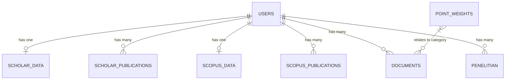

# 🌌 PentaDosen Backend - API & Database System

Selamat datang di repositori backend **PentaDosen**, sistem manajemen kinerja dosen yang mengintegrasikan data dari Google Scholar, Scopus, dan sistem verifikasi dokumen internal.

---

## 🚀 Cara Menjalankan Project

Ikuti langkah-langkah di bawah ini untuk menyiapkan lingkungan pengembangan lokal:

### 1. Prasyarat
- PHP >= 8.2
- Composer
- SQLite (default) atau MySQL

### 2. Instalasi Dependensi
```bash
composer install
```

### 3. Konfigurasi Environment
Salin file `.env.example` menjadi `.env`:
```bash
cp .env.example .env
```
Pastikan `DB_CONNECTION` disetel ke `sqlite` (atau database pilihan Anda). Jika menggunakan SQLite, buat file database kosong:
```bash
touch database/database.sqlite
```

### 4. Setup Aplikasi
Generate key aplikasi dan jalankan migrasi serta seeder:
```bash
php artisan key:generate
php artisan migrate --seed
```
*Catatan: `--seed` akan membuat akun admin default dan data awal bobot poin.*

### 5. Jalankan Server
```bash
php artisan serve
```
Backend akan berjalan di `http://127.0.0.1:8000`.

---

## 📂 Struktur Database (ERD Logic)

Sistem ini menggunakan struktur database relasional yang berpusat pada tabel `users`. Berikut adalah penjelasan entitas utamanya:

### 1. Entitas Pengguna (`users`)
Menyimpan informasi dasar pengguna, role (Admin, Dosen, Pimpinan), dan kredensial integrasi (Scholar ID & Scopus ID).

### 2. Integrasi Publikasi Luar
- **`scholar_data` & `scholar_publications`**: Menyimpan profil ringkasan (h-index, sitasi) dan daftar karya ilmiah yang ditarik dari Google Scholar.
- **`scopus_data` & `scopus_publications`**: Menyimpan profil ringkasan dan daftar karya ilmiah yang ditarik dari Scopus API.

### 3. Manajemen Internal & KPI
- **`documents`**: Berkas yang diunggah dosen untuk verifikasi (Sertifikat, Jurnal, dll).
- **`penelitian`**: Data riwayat penelitian internal dosen.
- **`point_weights`**: Master data untuk menentukan bobot poin tiap kategori dokumen/publikasi guna perhitungan KPI.

### Visualisasi Relasi


---

## 🛠️ Fitur Utama Backend

- **Automated Sync**: Sinkronisasi data publikasi secara otomatis menggunakan Scraper (Scholar) dan API (Scopus).
- **KPI Calculation**: Perhitungan poin kinerja dosen secara otomatis berdasarkan kategori dokumen yang diverifikasi.
- **Role-Based Access Control (RBAC)**: Pembatasan akses fitur berdasarkan peran user (Admin LPPM, Admin Prodi, Dosen, Pimpinan).
- **Verification Workflow**: Alur verifikasi dokumen dari sisi admin untuk memastikan validitas data.

---

## 🔐 Akun Default (Seeder)

Setelah menjalankan `php artisan db:seed`, Anda dapat menggunakan akun berikut untuk testing:

| Role | Email | Password |
| :--- | :--- | :--- |
| **Admin LPPM** | `admin@univ.edu` | `password` |
| **Dosen** | `umam@univ.edu` | `password` |
| **Pimpinan** | `rektor@univ.edu` | `password` |

---

<p align="center">
  Dibuat dengan ❤️ untuk kemajuan akademisi Indonesia.
</p>
