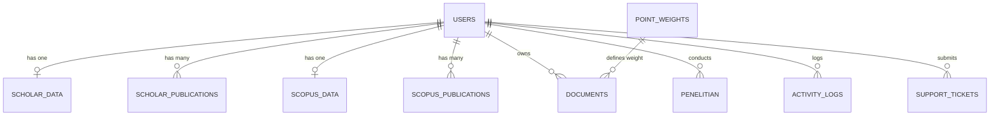

# PentaDosen - Backend API & Services

<p align="center">
  
  
  
  
</p>

---

## 1. Ringkasan Sistem

Repositori ini memuat layanan antarmuka pemrograman aplikasi (Backend REST API) dan pemrosesan data untuk platform **PentaDosen** Universitas YARSI.

Sistem bertanggung jawab mengelola logika bisnis perhitungan Key Performance Indicator (KPI) dosen, sinkronisasi publikasi ilmiah eksternal (Scopus, Google Scholar, SINTA), autentikasi terpusat (LDAP SSO YARSI), alur kerja verifikasi berkas Tri Dharma, serta penyediaan data analitik agregat untuk tingkatan program studi dan fakultas.

---

## 2. Tumpukan Teknologi (Tech Stack)

| Komponen | Pustaka / Layanan | Versi | Peran Teknis |
| :--- | :--- | :--- | :--- |
| Framework Inti | Laravel Framework | `^12.0` | Kerangka kerja aplikasi web backend berbasis MVC |
| Bahasa Pemrograman | PHP | `^8.2` | Runtime engine backend |
| Autentikasi API | Laravel Sanctum | `^4.0` | Pustaka autentikasi token / session guards |
| In-Memory Cache | Predis (`predis/predis`) | `^3.4` | Driver Redis untuk cache tagging dan percepatan query analitik |
| Basis Data | MySQL / TiDB Cloud / SQLite | Driver PDO | Penyimpanan relasional data pengguna, berkas, dan histori verifikasi |
| CLI Interaktif | Laravel Tinker | `^2.10.1` | Konsol REPL untuk debugging dan pemeliharaan data |
| Pengujian Unit | PHPUnit & Mockery | `^11.5` / `^1.6` | Kerangka kerja otomatisasi pengujian kode backend |

---

## 3. Integrasi Layanan Eksternal

1. **Universitas YARSI LDAP Server**:
   * Protokol: OpenLDAP / Active Directory PDC YARSI (`ldap://pdc.yarsi.ac.id:389`).
   * Fungsi: Verifikasi kredensial akun dosen dan pemetaan otomatis peran akun (`dosen`, `admin penelitian`).
   * Konfigurasi: Ditangani di `app/Http/Controllers/UserController.php`.

2. **Elsevier Scopus API**:
   * Layanan: Scopus Author Retrieval & Abstract Retrieval REST API.
   * Fungsi: Penarikan otomatis metadata artikel ilmiah internasional, nilai sitasi, dan quartile jurnal (Q1–Q4).
   * Konfigurasi: Diatur melalui variabel `SCOPUS_API_KEY` di `config/services.php`.

3. **Google Scholar via SerpApi**:
   * Layanan: SerpApi Google Scholar Author Engine.
   * Fungsi: Penarikan rekam jejak sitasi, indeks h, indeks i10, dan artikel yang terindeks di profil Google Scholar dosen.
   * Konfigurasi: Diatur melalui variabel `SERPAPI_KEY` di `config/services.php`.

4. **SINTA Scraper API**:
   * Layanan: Microservice ekstraksi data SINTA Kemendikbudristek.
   * Fungsi: Penarikan skor SINTA 3 Yr, SINTA Overall, serta pencocokan NIDN dosen.
   * Konfigurasi: Diatur melalui konstanta `API_URL` di `app/Services/SintaSyncService.php`.

5. **Redis In-Memory Caching & Tagging**:
   * Fungsi: Menyimpan agregasi leaderboard, statistik dosen, dan metadata publikasi. Menggunakan fitur `Cache::tags([...])` agar invalidasi cache saat ada perubahan data dapat dilakukan secara granular tanpa menghapus seluruh cache sistem.

---

## 4. Struktur Database dan Model Relasi

Basis data dirancang menggunakan model relasional yang berpusat pada entitas pengguna (`users`):


```mermaid
erDiagram
    USERS ||--o| SCHOLAR_DATA : "has one"
    USERS ||--o{ SCHOLAR_PUBLICATIONS : "has many"
    USERS ||--o| SCOPUS_DATA : "has one"
    USERS ||--o{ SCOPUS_PUBLICATIONS : "has many"
    USERS ||--o{ DOCUMENTS : "owns"
    USERS ||--o{ PENELITIAN : "conducts"
    USERS ||--o{ ACTIVITY_LOGS : "logs"
    USERS ||--o{ SUPPORT_TICKETS : "submits"
    POINT_WEIGHTS ||--o{ DOCUMENTS : "defines weight"
```

### Entitas Kunci
* `users`: Menyimpan data dosen dan staf (NIDN, email institusi, unit kerja, peran, tautan ID Scholar, dan Scopus).
* `scholar_data` & `scholar_publications`: Profil agregat (h-index, sitasi) dan daftar artikel hasil sinkronisasi Google Scholar.
* `scopus_data` & `scopus_publications`: Profil agregat dan daftar artikel hasil sinkronisasi Scopus beserta informasi quartile dan status corresponding author.
* `penelitian`: Data proposal dan laporan penelitian internal dosen beserta status verifikasi.
* `documents`: Berkas bukti fisik Tri Dharma (publikasi, HKI, buku ajar) yang diajukan untuk penilaian poin KPI.
* `point_weights`: Master bobot nilai kredit berdasarkan kategori dokumen dan jenis peran kepenulisan.
* `activity_logs`: Catatan riwayat audit aktivitas pengguna di dalam sistem.

---

## 5. Struktur Direktori Proyek

```text
app/
├── Http/
│   ├── Controllers/            # Pengendali alur request, validasi input, dan response JSON
│   │   ├── AdminController.php         # Manajemen verifikasi berkas dan direktori admin
│   │   ├── CmsController.php           # Pengaturan parameter bobot poin dan CMS
│   │   ├── DocumentController.php      # Manajemen unggah berkas, penautan, dan status
│   │   ├── NotificationController.php  # Pengelolaan notifikasi pengguna
│   │   ├── PenelitianController.php    # Manajemen data dan verifikasi penelitian
│   │   ├── ScholarController.php       # Sinkronisasi dan pemrosesan data Google Scholar
│   │   ├── ScopusController.php        # Sinkronisasi dan pemrosesan data Scopus API
│   │   ├── SintaController.php         # Endpoint sinkronisasi data SINTA
│   │   ├── SupportTicketController.php # Manajemen tiket bantuan dan pesan ke admin
│   │   └── UserController.php          # Otentikasi (Lokal & LDAP), profil, dan analitik
│   │
│   └── Middleware/             # Middleware HTTP (rate limiting, auth guards)
│
├── Models/                     # Representasi model Eloquent ORM
│   ├── ActivityLog.php
│   ├── CmsSetting.php
│   ├── Document.php
│   ├── Notification.php
│   ├── Penelitian.php
│   ├── PointWeight.php
│   ├── ScholarData.php
│   ├── ScholarPublication.php
│   ├── ScopusData.php
│   ├── ScopusPublication.php
│   ├── SupportTicket.php
│   └── User.php
│
└── Services/                   # Logika domain independen
    └── SintaSyncService.php    # Layanan pemrosesan dan normalisasi sinkronisasi SINTA

config/                         # Konfigurasi aplikasi, database, cache, dan layanan pihak ketiga
database/
├── factories/                  # Data generator untuk pengujian
├── migrations/                 # Skema migrasi tabel basis data relasional
└── seeders/                    # Data awal master bobot dan akun pengguna pengujian

routes/
├── api.php                     # Definisi rute REST API
└── web.php                     # Rute dasar sistem
```

---

## 6. Panduan Instalasi dan Menjalankan Backend

### Prasyarat Sistem
* PHP versi 8.2 atau lebih baru.
* Ekstensi PHP wajib: `pdo`, `mbstring`, `openssl`, `tokenizer`, `xml`, `ctype`, `json`, `curl`, `ldap` (untuk integrasi SSO YARSI).
* Composer versi 2.x.
* Server basis data: MySQL 8.x, TiDB, atau SQLite 3.
* Redis Server (direkomendasikan untuk optimalisasi cache tagging).

### Langkah Instalasi
1. Kloning repositori backend:
   ```bash
   git clone https://github.com/Umam07/BE-PentaDosen.git
   cd BE-PentaDosen
   ```

2. Pasang dependensi pustaka via Composer:
   ```bash
   composer install
   ```

3. Konfigurasi Environment Variables:
   Salin file template `.env.example` menjadi `.env`:
   ```bash
   cp .env.example .env
   ```
   Buka file `.env` dan sesuaikan koneksi database dan kredensial API:
   ```env
   APP_NAME=PentaDosen
   APP_ENV=local
   APP_KEY=
   APP_DEBUG=true
   APP_URL=http://localhost:8000

   # Konfigurasi Basis Data (contoh: SQLite)
   DB_CONNECTION=sqlite

   # Konfigurasi Caching (Redis direkomendasikan untuk fitur Cache Tags)
   CACHE_STORE=redis
   REDIS_CLIENT=predis
   REDIS_HOST=127.0.0.1
   REDIS_PORT=6379

   # Kunci Akses Layanan Eksternal
   SCOPUS_API_KEY=your_scopus_api_key_here
   SERPAPI_KEY=your_serpapi_key_here
   ```

   Jika menggunakan basis data SQLite lokal, buat file kosongnya:
   ```bash
   touch database/database.sqlite
   ```

4. Generate Application Key:
   ```bash
   php artisan key:generate
   ```

5. Jalankan Migrasi Basis Data dan Seeder:
   ```bash
   php artisan migrate --seed
   ```

6. Hubungkan Direktori Storage Publik:
   ```bash
   php artisan storage:link
   ```

7. Jalankan Server Pengembangan:
   ```bash
   php artisan serve
   ```
   Server backend akan aktif melayani request pada alamat `http://127.0.0.1:8000`.

---

## 7. Ringkasan Endpoint REST API

| Method | Endpoint | Deskripsi |
| :--- | :--- | :--- |
| `POST` | `/api/login` | Autentikasi pengguna via database lokal atau LDAP YARSI |
| `POST` | `/api/logout` | Mengakhiri sesi pengguna aktif |
| `GET` | `/api/users/{id}` | Mengambil detail profil dan rekap portofolio dosen |
| `GET` | `/api/dashboard/stats` | Statistik agregat metrik KPI dan total publikasi |
| `GET` | `/api/leaderboard` | Peringkat dosen berdasarkan akumulasi poin kinerja |
| `POST` | `/api/users/{id}/sync` | Memicu sinkronisasi data publikasi Google Scholar |
| `POST` | `/api/users/{id}/sync-scopus` | Memicu sinkronisasi data publikasi Scopus |
| `POST` | `/api/users/{id}/sync-sinta` | Memicu sinkronisasi skor dan data profil SINTA |
| `GET` | `/api/users/{id}/documents` | Mengambil seluruh berkas Tri Dharma milik dosen tertentu |
| `POST` | `/api/documents` | Mengajukan berkas baru untuk dinilai |
| `POST` | `/api/documents/{id}/verify` | Verifikasi status berkas oleh Administrator (Approve / Reject) |
| `GET` | `/api/penelitian` | Daftar riwayat penelitian institusional |
| `GET` | `/api/cms/weights` | Mengambil tabel master bobot penilaian KPI akademik |
| `GET` | `/api/admin/activity-logs` | Mengambil riwayat log audit aktivitas administratif |

---

## 8. Kredensial Akun Pengujian (Database Seeder)

Setelah menjalankan perintah `php artisan migrate --seed`, akun berikut tersedia untuk pengujian:

| Peran (Role) | Email Pengguna | Kata Sandi | Deskripsi Akses |
| :--- | :--- | :--- | :--- |
| Admin Penelitian (Master) | `superadmin@univ.edu` | `P3nt4D0s3nSuper@2026!` | Hak akses penuh verifikasi, konfigurasi CMS, dan audit log |
| Admin Penelitian | `penelitian@univ.edu` | `password` | Verifikasi dokumen dan pengelolaan master data penelitian |
| Admin Fakultas (FTI) | `fakultas@univ.edu` | `password` | Pengawasan dokumen dan profil dosen Fakultas Teknologi Informasi |
| Admin Fakultas (FEB) | `fakultas.feb@univ.edu` | `password` | Pengawasan dokumen dan profil dosen Fakultas Ekonomi dan Bisnis |
| Admin Fakultas (FK) | `fakultas.fk@univ.edu` | `password` | Pengawasan dokumen dan profil dosen Fakultas Kedokteran |
| Admin Fakultas (FH) | `fakultas.fh@univ.edu` | `password` | Pengawasan dokumen dan profil dosen Fakultas Hukum |
| Dosen (FTI) | `dosen1@univ.edu` | `password` | Portal portofolio dosen Fakultas Teknologi Informasi |
| Dosen (FEB) | `nurul.huda@univ.edu` | `password` | Portal portofolio dosen Fakultas Ekonomi dan Bisnis |
| Dosen (FK) | `kholis.ernawati@univ.edu` | `password` | Portal portofolio dosen Fakultas Kedokteran |
| Dosen (FH) | `endang.purwaningsih@univ.edu` | `password` | Portal portofolio dosen Fakultas Hukum |

---

## 9. Tim Pengembang dan Supervisi

Proyek PentaDosen dikembangkan dan dipelihara oleh DUK Team di bawah naungan Program Studi Teknik Informatika, Fakultas Teknologi Informasi, Universitas YARSI:

* **Dosen Pembimbing Utama**:
  * Nurmaya, S.Kom., M.Eng., Ph.D. — Pengarah Arsitektur Tata Kelola Data Akademik

* **Mahasiswa Pengembang Sistem (DUK Team)**:
  * Muhammad Syafi'ul Umam — Software Engineer ([GitHub](https://github.com/Umam07))
  * Kiki Aimar Wicaksana — Software Engineer ([GitHub](https://github.com/KikiAimarWicaksana))
  * Rafi Daniswara Anggoro Putra — Software Engineer ([GitHub](https://github.com/DanisMf))

---

<p align="center">
  Hak Cipta © 2026 PentaDosen • DUK Team — Universitas YARSI. Seluruh hak cipta dilindungi undang-undang.
</p>
